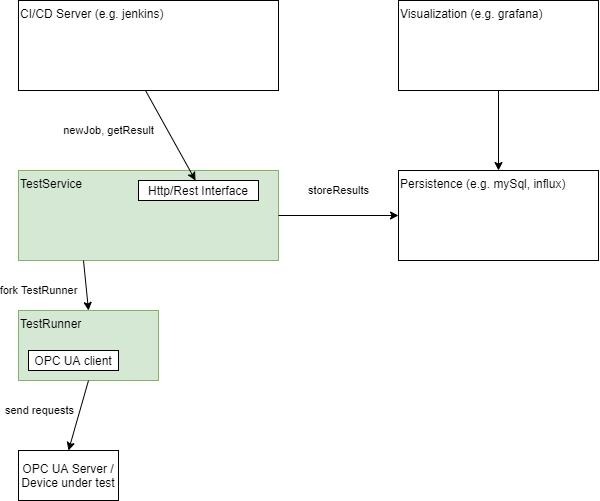

opcuaTestTool

## Overview

The main goal of this project is to automate OPC UA server performance testing.

## Architecture

Components in green are covered by this project. A http client can trigger new jobs, retrieve results. After requesting a new job, the TestService forks and executes the TestRunner. The TestRunner is a single threaded application, which parses the job configuration, connects to the OPC UA Server and executes the requests. After finishing the tests, a result file with json content is written.



## Jobs and Tasks

A job represents a single test run and contains 1-n tasks. Types of jobs:
* repetiveJob: runs for N iterations
* oneCycleJob: runs the tasks exactly once

A task is a single command, e.g. a read request or a wait. Types of tasks:
* readRequest: reads the value attribute of a node
* browseRequest: browses a node
* wait: pauses the job execution for N milliseconds
* generic: describe the service request in json encoding, as described in the opc ua specification specs https://prototyping.opcfoundation.org/Home/Read/

## REST interface

### Triggering a new job
```bash
curl -H "Content-Type: application/json" --data @tests/rest/newJob.json http://localhost:9080/jobs
```
The test service assigns a unique id to the new job (ids are ordered), this id can be used to address the job in further requests.

### Get finished jobs
getting all of them
```bash
curl http://localhost:9080/jobs?finished=true
```

getting jobs starting at a certain id
```bash
curl http://localhost:9080/jobs?finished=true&from=1000
```

### Get results of job with id 0
```bash
curl http://localhost:9080/jobs/0
```

## Integration with InfluxDB and Grafana

Start influxDB
sudo docker run -p 8086:8086       -v $PWD:/var/lib/influxdb       influxdb

Start Grafana
sudo docker run -d --name=grafana -p 3000:3000 grafana/grafana

### some good reads
https://florimond.dev/blog/articles/2018/08/restful-api-design-13-best-practices-to-make-your-users-happy/


